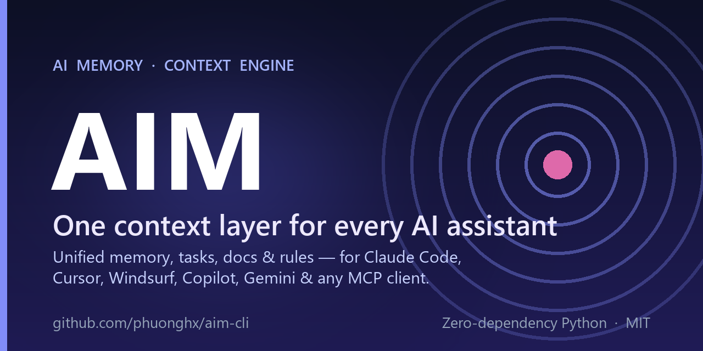

<div align="center">



[](https://github.com/phuonghx/aim-cli/actions/workflows/ci.yml)
[](https://github.com/phuonghx/aim-cli/releases)
[](LICENSE)
[](https://www.python.org/)
[](https://phuonghx.github.io/aim-cli/)
[](CONTRIBUTING.md)

[**Documentation**](https://phuonghx.github.io/aim-cli/) · [Quick start](#-installation--initialization) · [CLI reference](https://phuonghx.github.io/aim-cli/cli-reference/) · [MCP server](#-mcp-server-live-ai-integration) · [Contributing](CONTRIBUTING.md)

</div>

---

**AIM (AI Memory / Mind)** keeps your project's **memory, tasks, docs, and conventions** in one place and compiles them into the native instruction files each assistant expects — `CLAUDE.md`, `AGENTS.md`, `.cursorrules`, `.windsurfrules`, `GEMINI.md`, and `copilot-instructions.md`. It serves the same context **live over the Model Context Protocol (MCP)**, fights **context drift** with `aim doctor`, and syncs tasks to **GitHub Issues & Projects** — all zero-dependency Python.

It also installs AIM's suite of specialist agents, skills, and workflows, and exposes custom slash commands (`/commit`, `/pr`, `/review`, `/test`, `/docs`, `/optimize`).

<sub>**Topics:** ai · llm · context-engineering · ai-memory · claude-code · cursor · windsurf · github-copilot · mcp · model-context-protocol · ai-agents · developer-tools · cli · python</sub>

---

## 🏗️ Folder Structure

```plaintext
aim-cli/
├── .github/
│   └── workflows/
│       └── release.yml           # GitHub Actions release pipeline
├── aim/                          # Module directory
│   ├── templates/                # Full suite of AIM specialist agents, skills, and workflows
│   ├── skills/                   
│   ├── __init__.py
│   ├── aim_cli.py                # Core AIM CLI engine
│   ├── browser_server.py         # Dashboard web server
│   └── sync.py                   # Standalone synchronizer script
├── .gitignore
├── install.ps1                   # One-line installer for Windows PowerShell
├── install.sh                    # One-line installer for macOS/Linux Bash
├── MANIFEST.in                   # Packaging manifest file
├── setup.py                      # Package installation config
├── setup.bat                     # Windows batch installer helper
├── aim.bat                       # Windows CLI wrapper (development)
├── aim.sh                        # Bash CLI wrapper (development)
└── README.md                     # This documentation
```

---

## 🚀 Installation & Initialization

### One-line install

**Windows (PowerShell):**
```powershell
iwr -useb https://raw.githubusercontent.com/phuonghx/aim-cli/main/install.ps1 | iex
```

**macOS / Linux:**
```bash
curl -fsSL https://raw.githubusercontent.com/phuonghx/aim-cli/main/install.sh | bash
```

**Or directly via pip:**
```bash
pip install git+https://github.com/phuonghx/aim-cli.git
# optional: embeddings for `aim search --semantic` + doctor similar-memory check
pip install "aim-cli[semantic] @ git+https://github.com/phuonghx/aim-cli.git"
```

Then initialize AIM in your project:
```bash
aim init          # set up .ai-context/, skills, and agent suite
aim --version     # verify the installed version
```

By default, `aim init` runs interactively in a TTY to let you:
- Select which target AI agents to enable (Claude, Cursor, Windsurf, Antigravity, etc.).
- Choose a Git tracking strategy for generated files (`track-all`, `ignore-all`, or `rules-only`).
- Choose whether to generate `/aim-<skill>` slash commands for active agents.

You can also pass arguments to skip interactive prompts (useful in scripts or CI):
```bash
aim init --all-agents --git-ignore
```

Re-running `aim init` on an existing workspace will update the settings in `config.json` without overwriting your customized skills/agents — use `aim init --force` to reinstall templates completely (a timestamped `.bak` backup is kept).

**Already have rules scattered across files?** Pull your existing CLAUDE.md /
`.cursorrules` / `.clinerules` / AGENTS.md into AIM in one step:
```bash
aim ingest --dry-run     # preview
aim ingest && aim sync   # consolidate, then re-emit everywhere
```

### Troubleshooting: `aim` is not recognized / command not found

This almost always means pip installed the `aim` executable into a **Scripts**
folder (Windows) or **bin** folder (macOS/Linux) that is not on your `PATH`.
During install pip even prints a hint such as
`WARNING: The script aim is installed in '...' which is not on PATH`.

The one-line installers now detect this and offer to add the folder to your
`PATH` for you (answer `Y` at the prompt), then ask you to open a new terminal.
If you still hit the error, fix it manually:

**Windows (PowerShell)** — find the folder and add it to your user PATH:
```powershell
# Show where the console scripts live (check both lines for aim.exe):
python -c "import sysconfig; print(sysconfig.get_paths('nt_user')['scripts']); print(sysconfig.get_paths('nt')['scripts'])"

# Add the right folder (replace the path) to your user PATH, then reopen the terminal:
$d = "C:\Users\<you>\AppData\Roaming\Python\Python3XX\Scripts"
[Environment]::SetEnvironmentVariable('Path', [Environment]::GetEnvironmentVariable('Path','User').TrimEnd(';') + ';' + $d, 'User')
```
> Tip: the error text `'aim' is not recognized as an internal or external command`
> is from **cmd.exe**. If you installed in PowerShell, run `aim` in PowerShell too.

**macOS / Linux** — add the bin folder to your shell startup file:
```bash
# Show where the console scripts live (usually ~/.local/bin):
python3 -c "import sysconfig; print(sysconfig.get_paths('posix_user')['scripts'])"

echo 'export PATH="$PATH:$HOME/.local/bin"' >> ~/.zshrc   # or ~/.bashrc
source ~/.zshrc
```

**No-PATH workaround (any OS)** — run AIM as a module without changing PATH:
```bash
python -m aim.aim_cli init
```

### Staying up to date
AIM checks for a newer release at most once a day (GitHub Releases API) and
prints a one-line notice **only in an interactive terminal** — pipes, CI, the
MCP server, and agent invocations stay silent. It checks at most once a day and
never fails a command. To update:
```bash
aim upgrade            # runs the pip upgrade for you
```
Opt out of the notice with `AIM_NO_UPDATE_CHECK=1`.

### From a repository checkout (development)
Run via the included wrappers without installing:
- `aim.bat` (Windows) / `aim.sh` (Unix-like shells) at the repo root.

---

## 🔄 Synchronization

If you modify project settings, conventions, or add custom instructions in `.ai-context/config.json`, propagate the updates to all AI runtimes by running:

```bash
aim sync
# or: python aim/sync.py
```

Generated content is written between `<!-- AIM:BEGIN -->` / `<!-- AIM:END -->` markers — anything you write outside the markers in these files is preserved on every re-sync (pre-existing files without markers are backed up to `.bak` once).

This updates:
* **Claude Code**: `CLAUDE.md` (project commands, style constraints, and active skills references).
* **Cross-tool agents** (OpenAI Codex, Jules, etc.): `AGENTS.md` (the shared agent-instructions convention).
* **Gemini CLI / Code Assist**: `GEMINI.md`.
* **Antigravity**: `ANTIGRAVITY.md` (agent planning flow, Knowledge Items policy, validation).
* **Cursor**: `.cursor/rules/aim.mdc` (modern project-rules format) plus legacy `.cursorrules`.
* **Windsurf**: `.windsurfrules`.
* **GitHub Copilot**: `.github/copilot-instructions.md` (metadata context).

---

## 🔌 MCP Server (Live AI Integration)

Beyond static instruction files, AIM can serve the workspace live over the **Model Context Protocol**, so assistants query tasks/docs/memories directly:

```bash
# Claude Code
claude mcp add aim -- aim mcp
```

```json
// Cursor (.cursor/mcp.json)
{ "mcpServers": { "aim": { "command": "aim", "args": ["mcp"] } } }
```

Exposed tools: `list_tasks`, `get_task`, `create_task`, `create_tasks`, `next_task`, `search`, `get_memory_context`, `add_memory`, `list_memories`, `record_correction`, `review_memory`, `doctor`. `get_memory_context` returns the most relevant memories (ranked by relevance × importance × recency) as a compact block to inject as working memory at the start of a task. Plus a `decompose_prd` prompt that turns a PRD into dependency-ordered tasks via `create_tasks`. Zero external dependencies — pure stdlib JSON-RPC over stdio.

When the user corrects the agent mid-session, the agent can call
`record_correction(...)` to persist the lesson as a memory — it then syncs to
every tool, so the next session (in any client) does not repeat the mistake.

---

## 🐙 GitHub sync (`aim github`)

Project AIM tasks onto GitHub Issues + Projects so your team gets a familiar
board, while AIM stays the agent's working layer. Zero-dependency — it shells out
to the `gh` CLI (requires `gh auth login`).

```bash
aim github create-project "AIM Roadmap"   # create a Project (v2)
aim github push --all --project 3         # create/update an issue per task, add to the project, sync Status
aim github pull --all                     # two-way: reconcile tasks from issue state/title
aim github status --check                 # report drift between AIM and GitHub
```

Issues are idempotent (the issue number is stored back in each task); a `done`
task closes its issue, and `push --project` sets each card's Status field. Sync
is two-way: `pull` brings issue state/title changes back into AIM (GitHub is
canonical for state/title; AIM stays canonical for acceptance criteria,
dependencies, and spec links).

---

## 🩺 Context Health (`aim doctor`)

AIM's wedge is fighting **context drift** — stale rules and decisions that make
agents confidently wrong. `aim doctor` detects it deterministically (no LLM):

```bash
aim doctor          # full report; exits non-zero on high/medium findings (CI-friendly)
aim doctor --mine   # only memories you authored
```

It cross-references each memory's `refs` against git history (e.g. "this decision
mentions `aim/auth.py`, which changed 23 commits since you last reviewed it →
likely stale → run `aim memory review 4`"), and flags broken references,
duplicate task IDs, and spec drift.

---

## 📐 Spec-driven development (`aim spec`)

Scaffold a feature the spec-driven way (à la GitHub spec-kit / AWS Kiro) — a
requirements → design → tasks gate, with testable **EARS** acceptance criteria:

```bash
aim spec new "Checkout redesign"   # creates docs/specs/<slug>/{requirements,design,tasks}.md
                                   # + an umbrella task linked via --spec
aim spec coverage                  # spec-link coverage across tasks
aim spec import ./specs/feature    # import an existing spec-kit directory
```

`requirements.md` is pre-filled with EARS templates (`WHEN … THE SYSTEM SHALL …`).
Then break `tasks.md` into tracked tasks via the MCP `decompose_prd` prompt or
`aim task create … --depends-on`.

## 🧹 Skill linting (`aim lint`)

Validate `SKILL.md` files against the Agent Skills conventions (required
`name`/`description`, name↔folder match, size limits, and the legacy
`when_to_use` field):

```bash
aim lint .aim-agents/skills        # report findings (errors/warnings/info)
aim lint .aim-agents/skills --fix  # fold `when_to_use` into `description` in place
aim lint .aim-agents/skills --strict   # exit non-zero on warnings too (CI)
```

---

## 🛠️ CLI Reference

### 1. Task & Subtask Hierarchy Management
Manage project tasks, build parent-child subtask relationships, and categorize with labels.

```bash
# Create a task (supports parent ID, labels, spec, and plan)
aim task create "Implement landing page SEO" -d "SEO optimization" --ac "Add tags" -p high -a "alice" --parent 1 -l bug -l seo --spec "@doc/sdd/seo.md"

# List tasks (prints an indented tree view showing subtasks and tags)
aim task list

# View task details
aim task view <id>

# Edit task properties, add/remove tags, set spec/plan paths
aim task edit <id> -s in-progress --parent 2 --add-label frontend --remove-label bug -d "Updated description"
aim task edit <id> --check-ac 1     # Check off AC index 1 (1-based)
```

### 1.5. User Database & Assignment (CRUD)
Manage project team members and assign tasks.

```bash
# List all registered users
aim user list

# Register a new user
aim user add <username>

# Rename an existing user (automatically propagates assignee updates to all active tasks)
aim user rename <old_username> <new_username>

# Remove a user (system default users are protected)
aim user remove <username>
```

### 1.6. Project Status & ASCII Kanban Board
Check project health statistics and view your tasks in a lightweight ASCII Kanban board right inside the terminal.

```bash
# View project status summary (stats for tasks, docs, memories, time tracking, and sync health)
aim status

# Display the tasks arranged as an ASCII Kanban board (columns: TODO, IN-PROGRESS, IN-REVIEW, DONE)
aim board
```

### 1.7. Task Time Tracking
Track the exact time spent working on specific tasks directly from your CLI.

```bash
# Start timer for a task
aim time start <task_id>

# Check current active timer status
aim time status

# Stop active timer and optionally add a note
aim time stop -n "Implemented feature X"

# View time log entries for a specific task
aim time log <task_id>

# Generate a project time tracking report
aim time report
```

### 1.8. Code Generation Templates
Scaffold, view, and execute reusable code generation templates with dynamic variables and case-helpers:

```bash
# List all available templates
aim template list

# Create a new template scaffold (creates folder under .ai-context/templates/<name>/)
aim template create <template_name>

# View the configuration of a specific template
aim template view <template_name>

# Run a template (prompts for missing variables)
aim template run <template_name>

# Run with predefined variables
aim template run <template_name> -v name="MyComponent"

# Dry-run execution to preview output files without writing to disk
aim template run <template_name> --dry-run -v name="MyComponent"
```

### 2. Structured Documentation
Scaffold, list, and read Markdown docs inside `.ai-context/docs/`.

```bash
# Create a doc
aim doc create "API Auth" -f "architecture" -d "JWT auth guide"

# List docs
aim doc list

# View a doc
aim doc view architecture/api-auth
```

### 3. Persistent Memory
Save reusable patterns, decisions, or rules that AI should recall between sessions.

```bash
# Save a decision or rule (--importance 1-10 biases recall ranking)
aim memory add "We use repository pattern for database transactions" -c decision -l project --importance 8

# List saved memories
aim memory list

# Assemble the most relevant memories as a context block (for agents)
aim memory context "database access"      # ranked by relevance × importance × recency
```

### 4. Semantic Search
Perform keyword and regex matching across all tasks, docs, and memories:

```bash
aim search "auth"
```

### 5. Link Validation
Scan tasks and documents for broken mentions (e.g. `@task-X` or `@doc/path` linking to non-existent resources):

```bash
aim validate
```

---

## 🤖 Supported Clients & How They Use It

### 1. Claude Code
Claude Code automatically loads `./CLAUDE.md` to learn about compile commands, test runs, code styling, and safety constraints.
- Trigger custom actions directly via slash commands:
  - `/commit`: Inspects git status/diff and formats conventional commit messages.
  - `/pr`: Standardizes PR titles, description layouts, and verification steps.
  - `/optimize`: Performs time/space complexity audits on targeted functions.
  - `/review`: Executes QA/Security code review checklists.
  - `/test`: Writes targeted tests based on the project's runner.
  - `/docs`: Automates writing docstrings, JSDoc, or markdown references.

### 2. Antigravity (Advanced Agentic Coding)
Antigravity reads `ANTIGRAVITY.md` which instructs it on:
- **Planning Mode**: Forcing the agent to write and get approval on `implementation_plan.md` before coding, track checklist tasks in `task.md`, and summarize verification in `walkthrough.md`.
- **Knowledge Items (KI) System**: Directing the agent to read workspace-specific memory snapshots in the local AppData knowledge folder first, preventing duplicated efforts.

### 3. Codex (Cursor & Windsurf)
Cursor and Windsurf read `.cursorrules` and `.windsurfrules` to:
- Adopt specific frameworks guidelines (e.g. Next.js App Router rules).
- Apply high-level visual styling rules (Harmonious palettes, glassmorphism, micro-animations, no placeholders).

### 4. GitHub Copilot
Copilot parses `.github/copilot-instructions.md` to align autocomplete recommendations with the project's tech stack and code conventions.
