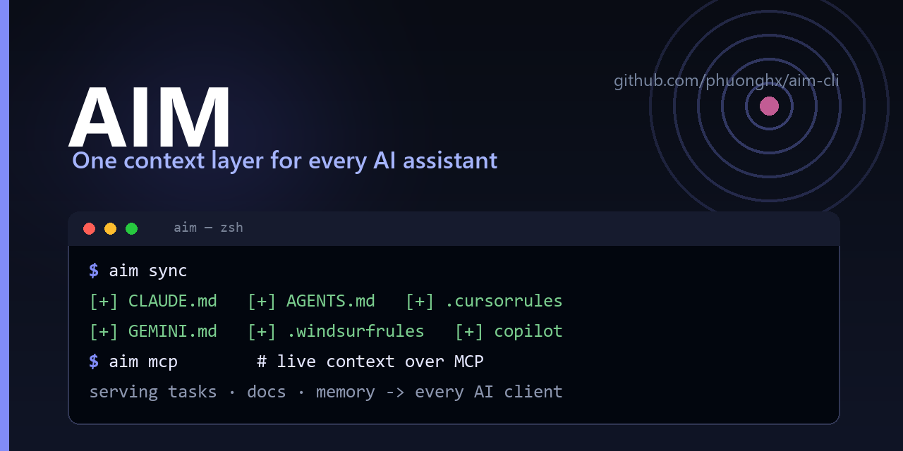

# AIM 🎯 — one context, every AI assistant

{ width="100%" }

**AIM (AI Memory / Mind)** is a zero-dependency command-line engine that keeps your
project's **memory, tasks, docs, and rules** in one place and compiles them into the
native instruction files every AI coding assistant expects — so **Claude Code,
Cursor, Windsurf, GitHub Copilot, Gemini, and Antigravity** all share the same brain.

It also serves that context **live over the Model Context Protocol (MCP)**, detects
**context drift** before it makes agents confidently wrong, and syncs your tasks to
**GitHub Issues & Projects**.

<div class="grid cards" markdown>

-   :material-sync: __One source of truth__

    Write rules once in `.ai-context/`. `aim sync` compiles `CLAUDE.md`,
    `AGENTS.md`, `.cursorrules`, `.windsurfrules`, `GEMINI.md`, and
    `copilot-instructions.md` — no more copy-paste drift across tools.

-   :material-brain: __Memory that ranks itself__

    Persist decisions and corrections; recall the most relevant ones with
    `get_memory_context` (relevance × importance × recency) as working memory for
    any agent.

-   :material-check-decagram: __Spec-driven tasks__

    `aim spec new` scaffolds requirements / design / tasks with **EARS**
    acceptance criteria, dependency-ordered and ready to decompose.

-   :material-stethoscope: __Context health (`aim doctor`)__

    Deterministically flags stale memory (vs git history), broken references, and
    duplicate IDs — CI-friendly, no LLM required.

-   :material-server-network: __Zero-dependency MCP server__

    `aim mcp` exposes tasks, docs, and memory to any MCP client over stdio — pure
    stdlib, nothing extra to install.

-   :material-view-dashboard: __Local web dashboard__

    `aim browser` opens a localhost Kanban board, knowledge graph, and a Health
    tab — token-protected, never exposed to the network.

</div>

---

## 🚀 Quick start

```bash
# Install
pip install git+https://github.com/phuonghx/aim-cli.git

# Initialize in your project, then compile instructions for every AI tool
aim init
aim sync

# Connect it live to Claude Code (or any MCP client)
claude mcp add aim -- aim mcp
```

Already have scattered rules? Pull existing `CLAUDE.md` / `.cursorrules` / `AGENTS.md`
into AIM in one step:

```bash
aim ingest --dry-run     # preview
aim ingest && aim sync   # consolidate, then re-emit everywhere
```

---

## 📚 Explore the docs

- **[CLI Reference](cli-reference.md)** — every command and flag.
- **[AI Agent Integration](agent-integration.md)** — how each assistant consumes AIM.
- **[Web Dashboard](dashboard.md)** — the visual control hub.
- **[Templates](templates-guide.md)** — code generation with variables and case helpers.
- **[Demo Walkthrough](demo-guide.md)** — a ready-made example workspace.
- **[Roadmap](ROADMAP.md)** — where AIM is headed.

---

## Why AIM?

Modern teams use several AI assistants at once, and each wants its rules in a
different file. Without a single source of truth those files drift, agents act on
stale assumptions, and the same mistakes repeat across sessions and tools. AIM fixes
the **context layer**: one place to write it, every tool to read it, and a doctor to
keep it honest.

> Free and open source under the [MIT License](https://github.com/phuonghx/aim-cli/blob/main/LICENSE).
